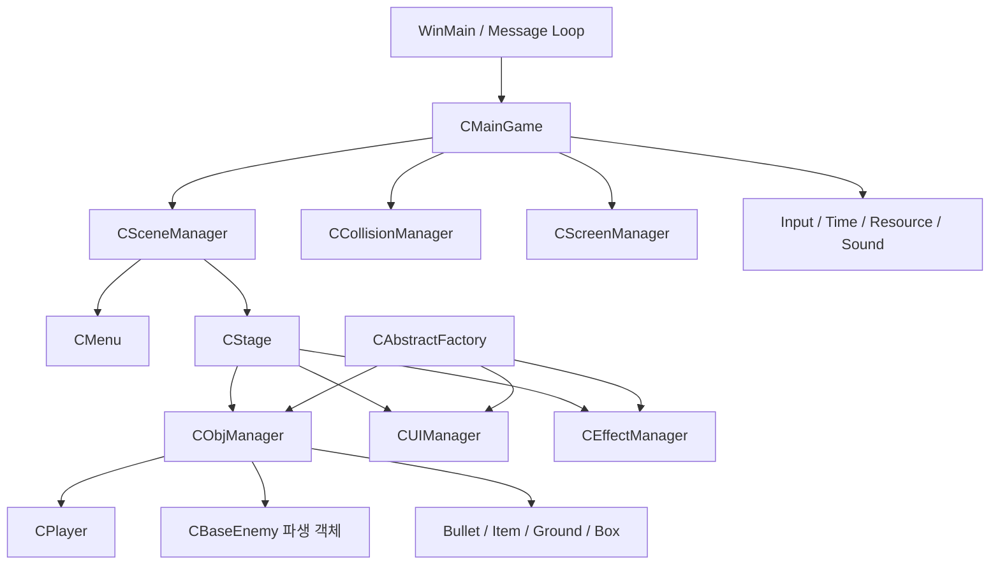

# My_API

> Win32 API와 GDI로 구현한 2D 횡스크롤 액션 슈팅 게임

플레이어가 다양한 총기와 보조 무기를 활용해 적을 돌파하고, 여러 구간을 거쳐 보스를 처치하는 싱글 플레이 게임입니다. 상용 게임 엔진 없이 Win32 메시지 루프부터 오브젝트 관리, 충돌, 애니메이션, 카메라와 화면 연출까지 직접 구성했습니다.


- 플레이 영상: https://www.youtube.com/watch?v=dmZgBtrUJjs&list=PLmfFrw50lE8_gS_yoKvSMk4_67kpLIhE2&index=61
- 개발 인원: 1인 개발
- 플랫폼: Windows

## 게임 소개

플레이어는 이동, 점프, 대시, 엄폐를 활용해 전투하며 스테이지에 배치된 적과 장애물을 돌파합니다. 권총, UZI, AK-47, 샷건 등의 주 무기와 나이프, 수류탄 등의 보조 무기를 사용할 수 있습니다.

스테이지는 여러 전투 구간으로 구성되며 마지막에는 별도의 등장 연출과 공격 패턴을 가진 보스가 출현합니다. 클리어 후에는 처치 수, 수집 요소, 사망 횟수와 플레이 시간 등을 결과 화면에서 확인할 수 있습니다.

### 주요 콘텐츠

- 다중 구간으로 구성된 횡스크롤 스테이지
- 근접·원거리·공중형 적과 무기별 전투 패턴
- 엄폐, 추적, 점프와 근접 공격을 조합하는 적 AI
- 권총, 기관단총, 돌격소총, 샷건 및 보조 무기
- 폭발 상자, 아이템 드롭과 수집 요소
- 보스 등장 시 줌, 레터박스, 페이드가 적용되는 시네마틱 연출
- 처치 수·수집률·사망 횟수·클리어 시간을 보여주는 결과 UI

## 조작 방법

| 입력 | 동작 |
| --- | --- |
| `←` / `→` | 좌우 이동 |
| `V` | 점프 / 아래 발판 통과 |
| `B` | 대시 |
| `C` | 주 무기 발사 |
| `Z` | 보조 무기 사용 |
| `X` | 주 무기 교체 / 아이템 획득 |
| `↑` | 엄폐 |
| `↓` | 앉기 |
| `Enter` | 메뉴에서 게임 시작 |
| `Esc` | 게임 종료 |

## 기술 스택

| 분류 | 기술 |
| --- | --- |
| Language | C++ |
| Platform | Windows 10/11 |
| Graphics | Win32 API, GDI/GDI+ |
| Audio | FMOD |
| IDE / Toolset | Visual Studio 2022, MSVC v143 |
| Architecture | Scene 기반 구조, 다형적 Object 생명주기, Singleton Manager |
| Patterns | 템플릿 기반 Factory, FSM, 충돌 Callback |

## 담당 영역

1인 프로젝트로 다음 영역을 직접 설계하고 구현했습니다.

- Win32 메시지 루프 기반 게임 실행 구조
- Scene 전환 및 게임 오브젝트 생명주기 관리
- 템플릿 기반 오브젝트 생성 Factory
- AABB 충돌 검사와 충돌 대상 마스크
- 플레이어 이동, 점프, 대시, 엄폐와 무기 시스템
- FSM 기반 적 AI 및 보스 패턴
- 스프라이트 시트 기반 캐릭터 애니메이션
- GDI 더블 버퍼링, 카메라 추적과 화면 컬링
- 화면 흔들림, 줌, 레터박스와 페이드 연출
- UI, 이펙트, 사운드 및 이미지 리소스 관리
- 스테이지 배치, 적 스폰, 아이템과 결과 화면 구성

## 시스템 구조



### 프레임 처리 순서

```text
Win32 메시지 처리
    ↓
Scene 및 Object Update
    ↓
충돌 검사와 OnCollision 전달
    ↓
Scene 및 Object LateUpdate
    ↓
백 버퍼에 Scene 렌더링
    ↓
카메라·줌·셰이크·페이드 적용 후 화면 출력
```

`CMainGame`이 최상위에서 프레임 순서를 제어하고, `CSceneManager`가 메뉴와 스테이지를 공통 `CScene` 인터페이스로 교체합니다. 각 Scene은 `Initialize`, `Update`, `LateUpdate`, `Render`, `Release` 생명주기를 가집니다.

## 주요 시스템

### 1. 다형적 게임 오브젝트 관리

플레이어, 적, 탄환, 아이템과 지형은 공통 기반 클래스 `CObj`를 상속합니다.

```cpp
class CObj
{
public:
    virtual void Initialize() = 0;
    virtual int  Update() = 0;
    virtual void LateUpdate() = 0;
    virtual void Render(HDC hDC) = 0;
    virtual void Release() = 0;
};
```

`CObjManager`는 객체를 `OBJID`별 리스트로 분류하고 구체 타입과 무관하게 일괄 갱신합니다. `Update()`가 `OBJ_DIE`를 반환한 객체는 Manager가 리스트에서 제거하고 메모리를 해제합니다.

이를 통해 새로운 오브젝트를 추가하더라도 전체 게임 루프를 변경하지 않고 동일한 생명주기에 참여시킬 수 있습니다.

### 2. 템플릿 기반 객체 Factory

반복되는 `new → Initialize → 위치·방향·속성 설정` 과정을 `CAbstractFactory<T>`로 통합했습니다.

```cpp
CObjManager::Get_Instance()->Add_Object(
    ENEMY,
    CAbstractFactory<CShootingEnemy>::Create(x, y, direction)
);
```

생성된 객체는 `CObj*`, `CUI*`, `CEffect*` 등의 기반 클래스 포인터로 반환되어 각 Manager에서 다형적으로 관리됩니다.

> 클래스명은 `CAbstractFactory`이지만, 구현 형태는 관련 객체군을 생성하는 전통적인 GoF 추상 팩토리보다는 **템플릿 기반 제네릭 Factory**에 가깝습니다.

### 3. 충돌 마스크 기반 AABB 충돌

`CCollisionManager`는 `OBJID × OBJID` 형태의 충돌 마스크를 사용합니다. Stage가 `PLAYER ↔ GROUND`, `BULLET ↔ ENEMY`처럼 필요한 조합만 활성화하므로 불필요한 종류 간 검사를 제외할 수 있습니다.

충돌 시 두 사각형의 겹친 깊이를 비교해 상·하·좌·우 방향을 계산하고 양쪽 객체의 `OnCollision()`에 결과를 전달합니다. 충돌 Manager는 피해량이나 착지 같은 세부 규칙을 알지 않으며, 각 객체가 상대 종류에 맞는 반응을 수행합니다.

### 4. FSM 기반 적 AI

적은 `IDLE`, `CHASE`, `FIRE`, `TAKE_COVER`, `RELOAD`, `JUMP`, `MELEE`, `KNOCKBACK`, `DIE` 등의 상태를 사용합니다.

```text
플레이어 탐지
    ↓
거리와 높이 비교
    ↓
근접 공격 / 사격 / 엄폐 / 추적 패턴 선택
    ↓
현재 상태에 맞는 이동·공격·애니메이션 수행
```

공통 탐지와 추적은 `CBaseEnemy`가 담당하고, 근접 적·사격 적·공중 적·보스가 각자의 상태 전환과 공격 방식을 확장합니다. 보스는 일반 적과 다른 패턴 주기, 투사체와 근접 공격 및 별도의 등장 연출을 가집니다.

### 5. 무기와 인벤토리

주 무기는 공통 `CGun` 인터페이스를 통해 발사 딜레이, 탄속, 탄창, 자동 사격 여부를 관리합니다. 무기별 `Fire()` 구현이 서로 다른 탄환과 총구 이펙트를 생성합니다.

플레이어는 `std::unique_ptr` 기반 주·보조 무기 슬롯을 보유하며, 필드에서 획득한 무기로 비활성 슬롯을 교체할 수 있습니다. UI는 현재 무기, 탄약과 보조 무기 쿨타임을 플레이어 상태에 맞춰 갱신합니다.

### 6. 카메라와 렌더링

`CScreenManager`가 GDI 백 버퍼를 만들고 모든 Scene을 오프스크린 DC에 그린 뒤 최종 화면을 출력합니다.

- 플레이어 목표 위치를 따라가는 Smooth Damp 카메라
- 스테이지 크기를 기준으로 한 카메라 경계 제한
- 카메라 영역 밖 오브젝트 렌더링 제외
- 피격·폭발에 사용하는 화면 흔들림
- 보스 연출용 시네마틱 줌과 레터박스
- 화면 전환용 페이드

배경은 고정 배경, 패럴랙스 레이어와 맵 캐시로 분리해 월드 오브젝트 및 UI와 순서대로 합성합니다.

### 7. UI·Effect·Resource 관리

게임 오브젝트와 별도로 `CUIManager`와 `CEffectManager`를 두어 각 요소를 종류별 리스트로 관리합니다. 체력 UI는 대상 객체를 참조해 위치와 체력을 따라가며, 이펙트 역시 생성 시 전달받은 대상이나 발사 위치를 기준으로 렌더링합니다.

이미지와 사운드는 각각 `CBmpMgr`, `CSoundMgr`에서 키 기반으로 관리해 중복 로드와 직접적인 리소스 접근을 줄였습니다.

## 프로젝트 구조

```text
My_API/
├─ My_API.sln                 # Visual Studio Solution
├─ My_API/
│  ├─ My_API.cpp              # Win32 진입점과 메시지 루프
│  ├─ CMainGame.*             # 시스템 초기화와 프레임 제어
│  ├─ CSceneManager.*         # Scene 생성 및 전환
│  ├─ CStage.*                # 스테이지 콘텐츠 구성
│  ├─ CObjManager.*           # 게임 오브젝트 생명주기
│  ├─ CAbstarctFactory.h      # 템플릿 기반 객체 Factory
│  ├─ CollisionManager.h      # 충돌 마스크와 AABB 검사
│  ├─ CScreenManager.h        # 백 버퍼, 카메라와 화면 연출
│  ├─ CPlayer.*               # 플레이어 상태와 입력
│  ├─ CBaseEnemy.*            # 적 공통 탐지 및 추적
│  └─ ...                     # 무기, UI, Effect, Resource
├─ Image/                     # 이미지 리소스
└─ Sounds/                    # 사운드 리소스
```


## 구현 과정에서 해결한 문제

### 객체 종류 증가에 따른 반복 코드

객체마다 생성과 초기화 코드를 직접 작성하면 위치·방향 설정 누락과 중복이 발생했습니다. 템플릿 Factory와 Manager 등록 구조를 적용해 객체 추가 과정을 일관되게 만들었습니다.

### 객체 간 결합도가 높아지는 충돌 처리

충돌 검출과 실제 반응을 분리했습니다. 충돌 Manager는 교차 여부와 방향만 계산하고, 피해·착지·아이템 획득은 각 객체의 `OnCollision()`에서 처리하도록 구성했습니다.

### 큰 월드 렌더링 비용과 화면 연출

카메라 영역을 기준으로 화면 밖 오브젝트를 컬링하고, 맵 배경을 캐시해 반복 합성 비용을 줄였습니다. 동일한 Screen Manager에서 줌, 흔들림, 레터박스와 페이드까지 처리해 보스 연출을 게임 렌더링 흐름에 통합했습니다.

### 움직이는 배경 적용 후 발생한 프레임 드롭

**문제**  
카메라 이동에 맞춰 넓은 배경 이미지를 매 프레임 확대·투명 합성하자 `TransparentBlt` 호출 비용이 누적되어 프레임이 저하됐습니다. 특히 월드 전체 크기의 이미지를 반복 가공하는 방식은 실제 화면에 보이지 않는 영역까지 처리한다는 문제가 있었습니다.

**해결**

- 스테이지 배경은 초기화 시 월드 크기의 호환 DC와 Bitmap에 한 번 합성해 캐시했습니다.
- 매 프레임에는 이미 가공된 `m_mapCacheDC`를 복사해 이미지 확대 연산의 반복을 제거했습니다.
- 움직이는 중간 배경은 하나의 타일 이미지를 사용하고, 카메라 위치에 패럴랙스 계수를 적용했습니다.
- 화면 폭과 타일 주기로 필요한 타일 개수를 계산해 현재 카메라 주변의 타일만 반복 렌더링했습니다.
- 게임 오브젝트도 카메라 사각형과 교차하는 객체만 그리도록 컬링했습니다.

```cpp
const int offset = static_cast<int>(camX * m_parallax);
const int drawCount = (WINCX + period * 2) / period + 4;

for (int i = 0; i < drawCount; ++i)
{
    TransparentBlt(/* 현재 화면에 필요한 타일만 합성 */);
}
```

**결과**  
매 프레임 수행하던 큰 이미지의 확대·합성을 초기화 시점의 1회 작업으로 옮기고, 움직이는 배경의 렌더 범위를 화면 주변으로 제한했습니다. 이를 통해 패럴랙스 효과를 유지하면서 배경 처리 비용을 줄였습니다.

### 무기 소유권을 명확히 하기 위한 `unique_ptr` 적용

**문제**  
주 무기와 보조 무기를 Raw Pointer로 관리하면 무기 교체 시 기존 객체의 해제 시점을 직접 관리해야 했습니다. 플레이어와 무기 중 누가 메모리를 해제해야 하는지가 불명확하면 누수나 중복 해제가 발생할 수 있었습니다.

**해결**  
무기를 실제로 장착하고 수명까지 관리하는 주체를 플레이어로 정하고, 주·보조 무기 슬롯을 `std::unique_ptr`로 구성했습니다.

```cpp
std::unique_ptr<CGun>       m_aMainWeaponSlot[2];
std::unique_ptr<CSubWeapon> m_aSubWeaponSlot[2];
```

새 무기를 획득하면 비활성 슬롯의 기존 무기를 `reset()`으로 정리한 뒤 `std::make_unique<T>()`로 교체합니다.

```cpp
template <typename T>
void CPlayer::PickUp_Gun(int magazine)
{
    m_aMainWeaponSlot[m_iDeActiveSlot].reset();
    m_aMainWeaponSlot[m_iDeActiveSlot] = std::make_unique<T>();
    m_aMainWeaponSlot[m_iDeActiveSlot]->Initialize();
    m_aMainWeaponSlot[m_iDeActiveSlot]->Set_Magazine(magazine);
}
```

**결과**  
플레이어가 무기의 단일 소유자라는 관계가 타입으로 명확해졌고, 무기 교체와 플레이어 소멸 시 메모리가 자동으로 해제되도록 만들었습니다. 또한 기반 클래스 포인터를 통해 권총·UZI·AK-47·샷건을 동일한 슬롯 인터페이스로 사용할 수 있게 했습니다.

### 플레이어가 구조물 뒤로 가려져야 하는 문제

**문제**  
맵 배경을 먼저 그리고 모든 오브젝트를 그리는 일반적인 순서에서는 플레이어가 문, 기둥과 건물 전면부보다 항상 앞에 출력됐습니다. 이 때문에 실제로 구조물 뒤에 있어도 캐릭터가 그대로 노출되어 깊이감과 엄폐 연출이 자연스럽지 않았습니다.

**해결**  
하나의 배경 이미지를 단순히 다시 그리는 대신, 플레이어보다 앞에 보여야 하는 영역을 별도의 전경 이미지와 `FRONTLAYER` 오브젝트로 분리했습니다. 렌더링 순서를 다음과 같이 구성했습니다.

```text
고정·패럴랙스·맵 배경
→ 일반 월드 오브젝트와 플레이어
→ FRONTLAYER 전경 오브젝트
→ 이펙트와 UI
```

전경 이미지는 마젠타 컬러 키를 사용하는 `GdiTransparentBlt`로 필요한 부분만 합성했습니다. 위치가 다른 전경은 `CFrontLayer`, `CFrontLayer1_2`, `CFrontLayer3`로 분리해 스테이지 구간에 맞게 배치했습니다.

**결과**  
별도의 깊이 버퍼나 복잡한 정렬 시스템 없이도 구조물의 앞·뒤 관계를 표현했고, 플레이어가 문이나 건물 전면부 뒤로 자연스럽게 가려지는 효과를 구현했습니다.

### 수류탄의 직선적인 움직임과 부자연스러운 착지

**문제**  
수류탄을 일정한 속도로 이동시키는 방식은 투척물이 직선으로 날아가는 것처럼 보였고, 지면에 닿는 즉시 멈추면 무게감도 부족했습니다.

**해결**  
투척 속도와 각도를 X/Y 초기 속도로 분해하고, 매 프레임 Y 속도에 중력 가속도를 누적해 탄도 운동을 구현했습니다.

```cpp
const float radians = throwAngle * (PI / 180.f);
vx = direction * throwSpeed * cosf(radians);
vy = -throwSpeed * sinf(radians);

vy += gravity * deltaTime;
x  += vx * deltaTime;
y  += vy * deltaTime;
```

지면과 충돌하면 수직 속도에 반발계수를 적용하고 수평 속도에는 마찰계수를 적용했습니다.

```cpp
if (vy > 0.f)
    vy = -vy * restitution;

vx *= friction;
```

반발계수 `0.45`로 튀어 오르는 높이가 충돌할 때마다 감소하고, 마찰계수 `0.90`으로 수평 이동도 점차 줄어들도록 구성했습니다. 큰 프레임 시간으로 궤적이 불안정해지는 것을 막기 위해 물리 계산의 `DeltaTime`도 최대 약 33ms로 제한했습니다.

**결과**  
수류탄이 발사 각도에 따른 포물선을 그리며 날아가고, 착지 후에는 점차 낮게 튀면서 감속하는 움직임을 표현했습니다. 정확한 설명은 “감쇠곡선으로 포물선을 생성”한 것이 아니라, **중력 기반 포물선 운동에 반발·마찰 감쇠를 추가한 구현**입니다.

## 개선 예정 사항

- Raw Pointer 소유권을 Smart Pointer 기반으로 전환
- Manager 간 전역 Singleton 의존성 축소
- Stage 내부에 하드코딩된 배치 정보를 외부 데이터로 분리
- 충돌 Broad Phase를 적용해 오브젝트 증가 시 검사 비용 개선
- 게임 로직과 애니메이션 시간을 단일 시간 체계로 통합
- 자동화된 빌드 및 핵심 로직 테스트 추가


